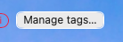

## What

The "Manage tags…" button in the board toolbar rendered as a native OS button
(macOS pill) instead of the toolbar's own control style. It sits beside the
epic/type filter selects, which c051 gave a shared pill language, so it stood
out.

## Acceptance criteria

- [x] The Manage tags button matches the toolbar pill language (c051): rounded
  pill, thin border, Canvas background, soft shadow, `0.8rem` font.
- [x] It stays legible over a board background image, like the toolbar selects.

## Notes

- Fix is pure CSS: `.tag-manage-button` in `Board.css` now mirrors
  `.board-toolbar select`, plus a `.board-with-bg` translucent variant. No
  behaviour change; existing button coverage in `App.test.tsx` still passes.
- Found unrelated i0110 WIP (tag-chip `tintColor` tests) uncommitted in the
  working tree; left it untouched and committed only my `Board.css` change.

## Log

- 2026-07-20 status → ready (app)
- 2026-07-20 status → in-progress (agent)
- 2026-07-20 status → review (agent)
