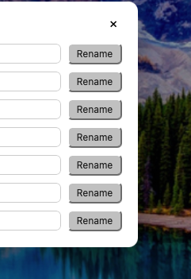

## What

The "Rename" button in the tag manager rendered as a native OS button (grey,
bevelled) instead of the app's control style. It sits in each tag row beside a
pill-styled rename input and colour swatch, so it stood out — the same class of
bug as i0111 for the Manage tags button.

## Acceptance criteria

- [x] The Rename button matches the toolbar pill language (c051 / i0111):
  rounded pill, thin border, Canvas background, soft shadow.
- [x] It keeps the row's smaller scale (`0.75rem` font, tight padding).

## Notes

- Fix is pure CSS: `.tag-manager-row button` in `TagManager.css` gained the
  missing border, background, colour, pill radius, and shadow. No behaviour
  change; existing `TagManager.test.tsx` rename coverage still passes. Pure
  styling, so no new test (same as i0111).
- The manager renders over its own Canvas modal, not the board background, so
  no `.board-with-bg` translucent variant is needed.

## Log

- 2026-07-20 status → ready (app)
- 2026-07-20 status → in-progress (agent)
- 2026-07-20 status → review (agent)
- 2026-07-20 status → done (app)
