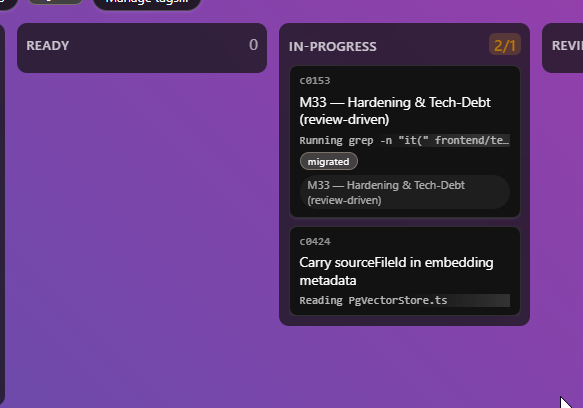

Asked claude to create a new card while the companion was already having one in progress.

Claude created the card in ready, and the companion picked it up immediately, it think even without waiting the set delay. Now there's two cards running although the board is set to have only one in progress:

## Log

- 2026-08-03 status → ready (app)
