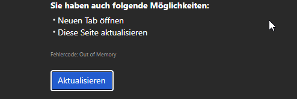

At least experienced on windows (this instance).

## What

The WebView2 renderer runs out of memory and shows its crash page ("Fehlercode:
Out of Memory"). The dominant retained cost is board-card thumbnails: c012 drew
the card front's thumbnail from the card's image at full resolution, base64'd
into a data URL and held in component state for every card that has one. The
thumbnail box is 260x112 CSS px, so a screenshot was decoded at up to 3024x1964
to be drawn into it, and every such card's bitmap was alive at once. It grows
with every screenshot pasted onto the board.

Board thumbnails now load a downscaled copy. The full-size image is decoded,
drawn once at thumbnail size and released; what stays in state is a few KB. The
decodes are serialised, so the peak is one full-size bitmap rather than all of
them. The card detail still loads the image at full resolution, and releases it
when the card closes.

## Acceptance criteria

- [x] A board-card thumbnail is a downscaled copy, capped at 512px on its long
      edge — never the card's full-resolution image
- [x] The full-size bitmap is released as soon as the thumbnail is drawn, also
      when the draw or encode fails
- [x] Thumbnails are decoded one at a time, so N card images never put N
      full-size bitmaps in memory
- [x] Downscaling never upscales, keeps the aspect ratio, and never asks a
      canvas for a zero dimension
- [x] A card image that can't be read or decoded still renders no thumbnail
      (c012 behaviour), and doesn't block the queue behind it
- [x] The open card detail still shows the image at full resolution
- [x] Settings › Show thumbnails (c0063) still toggles thumbnails

## Notes

- Measured on this board (`.gello/assets`, 23 card images, 19MB on disk):
  full-resolution decode was ~45MB of card bitmap plus ~26MB of base64 strings,
  the largest single card image being 3024x1964 (22.7MB decoded) drawn into a
  260x112 box. At 512px the same 23 thumbnails are ~6MB decoded and ~0.4MB of
  data URL. The board background (3840x2160, 31.6MB decoded) is untouched —
  it is one image, not one per card.
- `THUMB_MAX_PX = 512`: a card front is ~260 CSS px wide, so this covers a 2x
  display. The thumb is `object-fit: cover` into `max-height: 7rem`.
- Layering follows notify.ts/window.ts: `lib/thumbnail.ts` is the pure, tested
  part (size fitting, release ordering, the serial queue) and
  `lib/thumbnail-browser.ts` is the ``/canvas seam with nothing of its own
  to test. Nothing was added to Rust — the decode the webview needs is already
  in the webview.
- Thumbnails are re-encoded as WebP (quality 0.8); a webview without WebP
  encoding gets a PNG data URL from `toDataURL` instead. An animated GIF
  thumbnail becomes a still frame — acceptable for a 112px-tall card front.
- Remote (`http(s):`) and `data:` sources still pass straight through without
  being decoded, so no cross-origin image can taint the canvas.
- The cross-project activity view needed no change: its `loadImage` feeds
  CardDetail only, never a card front.
- Not verified in a real WebView2 — the repo has no e2e harness (the Playwright
  setup CLAUDE.md describes does not exist yet), and the canvas seam cannot run
  under jsdom. The unit tests cover the wiring and the release/ordering rules;
  confirming the crash is gone needs a session on Windows.
- Pre-existing red on Windows, unrelated and left alone: 6 failures in
  `companion/control.test.ts` and `companion/runner.test.ts`, all asserting
  POSIX path separators against `path.join` output (`\proj\.gello\...` vs
  `/proj/.gello/...`). They fail at HEAD with a clean tree. Worth its own card.
- Two further memory/CPU observations, deliberately out of scope here:
  the board background is held as a full-size data URL for the whole session,
  and `applyFileChanges` reparses all 250 cards on every watcher burst while
  two timers (1s pickup tick, 2s companion poll) re-render the whole tree.
  Both are churn rather than growth; neither scales with the number of images.

## Log

- 2026-08-26 status → ready (app)
- 2026-08-26 status → in-progress (agent)
- 2026-08-26 diagnosed (agent): board thumbnails decoded card images at full
  resolution and kept every one of them alive; measured ~110MB of retained
  bitmap + base64 on this board for images drawn into 260x112 boxes.
- 2026-08-26 implemented (agent): `lib/thumbnail.ts` (fitBox, shrinkToThumbnail,
  createSerialQueue) + `lib/thumbnail-browser.ts` (canvas seam) +
  `imageThumbnail` in board-io; board fronts use it, card detail keeps the
  full-size read. 18 thumbnail tests, 5 board-io tests, 2 App wiring tests.
