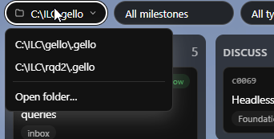

## What

The project switcher (ProjectMenu) shows the full folder path on Windows
instead of the short project name. `baseName` in `ProjectMenu.tsx` splits on
`/` only, so a backslash-separated Windows path (`C:\ILC\gello`) has no split
point and the whole path is rendered in the button and every recent-entry.

Same bug class as i0018, which already made `projectFolder` (status.ts)
separator-agnostic; the picker component was not updated to match.

## Acceptance criteria

- [x] `baseName("C:\\ILC\\gello")` → `gello` (Windows path)
- [x] `baseName("/home/x/gello")` → `gello` (POSIX path)
- [x] Trailing separators are tolerated (`C:\\ILC\\gello\\` → `gello`)
- [x] A path with no separator returns itself unchanged
- [x] Regression covered by a test that fails before the fix, passes after

## Log

- 2026-07-17 status → ready (app)
- 2026-07-17 status → in-progress: picked up; root cause is `baseName`
  splitting on `/` only (separator bug, cf. i0018)
- 2026-07-17 status → review: made `baseName` separator-agnostic; added
  Windows-path component tests (fail before, pass after). Suite 421/421 green.
- 2026-07-17 status → done (app)
