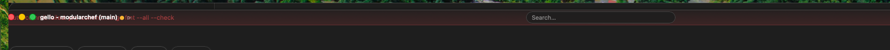

I cannot flose them, cannot read them properly because fo the chrome. Display them at the bottom as the card issues are displayed

## Acceptance criteria

- [x] The error banner renders below the board, not in the first flow slot the
      frameless title bar overlays.
- [x] Its text and its dismiss button are clear of the traffic lights.

## Notes

- Cause: `.titlebar` is `position: absolute; top: 0` with `z-index: 8`, while
  the banner was the first in-flow child of the shell. The two occupied the
  same strip and the title bar won.
- Fix: render `BoardError` after `<Board>`, so it is the last flex item in the
  shell — the same bottom placement as the needs-attention lane. The board
  (`flex: 1; min-height: 0`) shrinks to make room, so nothing is covered.
- CSS: border moved from bottom to top and `flex: none` added, so the bar reads
  as a foot and grows upward when the details box opens.
- The no-board view keeps the banner in its centred stack — nothing overlays it
  there.

## Log

- 2026-08-08 status → ready (app)
- 2026-08-08 status → in-progress (agent)
