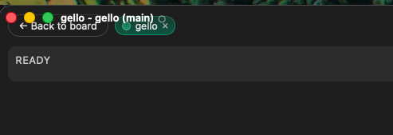

Makes them unusable

## Acceptance criteria

- [x] The activity view's bar (back, project chips, Add project) starts below
      the title bar, so its controls take clicks instead of the drag region.
- [x] The board keeps its existing clearance.

## Notes

- The view: the c0138 cross-project activity view. Its `.multi` root replaces
  `.board` in the frameless shell, but only `.board` had the
  `padding-top: calc(0.75rem + var(--titlebar-height))` rule in `App.css`. The
  bar started 12px down, under a title bar that overlays the top 34px at
  z-index 8 with a Tauri drag region — a click there dragged the window.
- Fix: `.multi` joins `.board` in that rule.
- jsdom does no layout, so a rendered assertion cannot see the overlap. The
  test reads `App.css` and asserts every shell-filling view has a `padding-top`
  keyed to `--titlebar-height` (the i0136 approach).

## Log

- 2026-08-08 status → in-progress (agent)
- 2026-08-08 pad `.multi` below the title bar, status → review
- 2026-08-08 status → review (agent)
