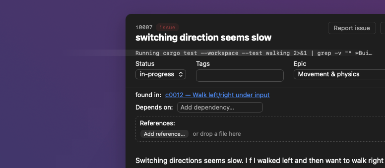

## What

The c0113 sweep band on a live activity line draws outside the card detail: a
lighter horizontal band sits on the backdrop to the left of the dialog, at the
height of the status line.

Cause: the band is a pseudo-element on `.card-activity-live` that starts at
`translateX(-100%)`, one line width to the left, and counts on being clipped
until it sweeps in. On a card front `.card-activity` clips it with `overflow:
hidden`. The detail relaxes that to `overflow: visible` (c0148) so a long
blocked list wraps, and nothing clipped the band any more.

## Acceptance criteria

- [x] The sweep band stays inside the status line in the card detail.
- [x] The band still sweeps on card fronts, and still starts off-line.
- [x] The clip is on the rule that owns the band, so no context can relax it.
- [x] A long unbreakable token in the detail status line wraps instead of
      running out of the dialog.

## Notes

- Fixed with `clip-path: inset(0)` on `.card-activity-live` rather than by
  putting `overflow: hidden` back in the detail: `clip-path` clips a
  pseudo-element to the border box whatever `overflow` says, so the clip travels
  with the animation into every context that shows the line (card front,
  multi-project front, detail). Appearance is unchanged.
- The detail's `overflow: visible` also let a long unbreakable token out of the
  dialog. Added `overflow-wrap: anywhere` there, as `.card-title` has since
  i0125 — without it the new clip would cut such a token off instead.
- Test is a stylesheet read (`activity-sweep-clip.test.ts`), following i0136:
  jsdom does no layout or painting, so a rendered assertion passes either way.

## Log

- 2026-08-09 status → ready (app)
- 2026-08-09 status → in-progress (agent)
- 2026-08-09 status → review (agent)
- 2026-08-09 status → done (app)
