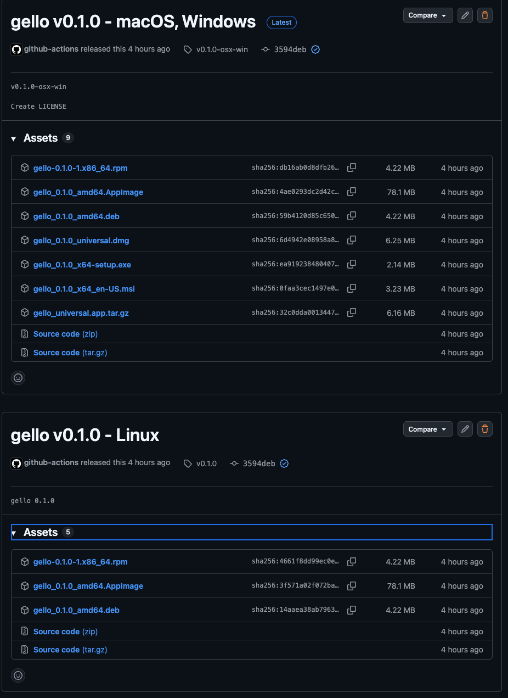

The renaming was done by me

## What

Bug: the release workflow (c019) produced **two** GitHub releases from one
tag push (both off commit 3594deb) instead of one. The "- macOS, Windows" /
"- Linux" titles in the screenshot are a manual rename to tell them apart;
the underlying defect is duplicate releases.

Root cause: in [.github/workflows/release.yml](.github/workflows/release.yml)
the `build` job is a 3-leg matrix (macOS / ubuntu / windows) and **every leg**
runs `tauri-action` with the same `tagName` + `releaseDraft: true`. With no
release yet existing for the tag, the concurrent legs each try to *create*
the draft release and race — GitHub ends up with duplicate/split releases.

Fix (canonical tauri-action multi-platform recipe): create the release once,
then have the matrix upload to it.

- A `create-release` job (runs first, no matrix) creates the draft release
  for the tag and outputs its `release_id`.
- The `build` matrix job `needs: create-release` and passes
  `releaseId: ${{ needs.create-release.outputs.release_id }}` to
  tauri-action — so each leg **uploads** to the one release instead of
  creating its own.
- A final `publish-release` job flips the draft to published after all
  matrix legs succeed.

## Acceptance criteria

- [~] A single tag push (`vX.Y.Z`) produces exactly **one** GitHub release
      with all platforms' assets — verified by design (single create-release);
      live confirmation is a human tag push (side-effectful)
- [x] `create-release` job creates the draft once and outputs `release_id`;
      `build` matrix consumes it via `releaseId` (no leg creates a release)
- [x] Matrix stays fail-fast:false so one platform's failure doesn't blast
      the others' uploads
- [x] `publish-release` un-drafts the release only after all builds upload
      (`needs: [create-release, build]`)
- [x] Re-running for an existing tag doesn't spawn a second release: a second
      `createRelease` for the same tag returns 422 and fails the job — safe
      (no duplicate), though not idempotent (delete the tag/release to re-run)

## Discussion

- **Matrix race, not a tag-naming bug**: the duplicate came from three
  concurrent legs each creating a draft for the same tag. `tauri-action`
  supports the create-once-then-upload pattern via `releaseId` precisely to
  avoid this.
- **Verification is external/side-effectful**: proving the fix means pushing
  a real tag and watching Actions cut one release — creates public releases,
  so it's the human's call to run (e.g. a throwaway `v0.0.0-rc` tag on a
  branch), not something to trigger blindly.
- **Clean-up**: the existing duplicate `v0.1.0` / `v0.1.0-osx-win` releases
  and stray tags should be deleted by hand once the workflow is fixed —
  out of scope for the workflow change itself.
- **Belongs with [[c019]]** (packaging), which owns the release pipeline.

## Notes

- `.github/workflows/release.yml` restructured into three jobs:
  `create-release` (github-script `createRelease`, draft:true, outputs
  `release_id`) → `build` matrix (`needs: create-release`, tauri-action with
  `releaseId` instead of `tagName`/`releaseName`/`releaseDraft`) →
  `publish-release` (`needs: [create-release, build]`, github-script
  `updateRelease` draft:false). Each job keeps `contents: write`.
- Tag comes from `github.ref_name` (preserves the `v*` push trigger and
  workflow_dispatch), release name `gello <tag>`.
- Verified statically (YAML parses; job graph + releaseId wiring correct via
  the `yaml` package). A live run creates public GitHub releases, so it's the
  human's to trigger — a throwaway tag on a branch is the safe way.
- Cleanup (manual, out of scope): delete the existing duplicate `v0.1.0` /
  `v0.1.0-osx-win` releases and stray tags.

## Log

- 2026-07-17 status → ready (app)
- 2026-07-17 diagnosed (agent): tauri-action matrix race (3 legs each create
  the draft for the same tag); fix = create-release job + releaseId upload +
  publish-release
- 2026-07-17 picked up (agent), status → in-progress
- 2026-07-17 rewrote release.yml (create-release → build/releaseId →
  publish-release), validated statically; live tag-push verification is the
  human's; status → review
- 2026-07-17 status → done (app)
