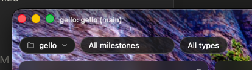

vert alignment is off
text is a hair too small
har to read depending on the background

## What

The frameless title-bar caption (`gello: <folder> (<branch>)`, c0059) reads
poorly over a board background. Three fixes in `TitleBar.css`:

- **Size + opacity**: caption goes from `0.72rem` / `0.75` opacity to
  **~0.8rem, full opacity** (matching the search text) — right now it reads
  like a faint watermark, not first-class chrome.
- **Vertical alignment**: centre the caption in the bar, visually aligned
  with the macOS traffic lights (it currently sits a touch high).
- **Legibility over any background**: strengthen the existing top scrim into
  a **vertical (top-down) gradient** — more opaque behind the caption band,
  fading to transparent lower down — so the title stays readable over a busy
  photo without a pill or text-shadow. The board background still bleeds
  through below.

## Acceptance criteria

- [x] Caption renders at ~0.8rem, full opacity
- [x] Caption is vertically centred in the title bar (aligned with the macOS
      traffic lights)
- [x] A top-down gradient scrim behind the bar keeps the caption legible over
      a busy/bright photo background
- [x] The scrim fades to transparent — no hard band; the background still
      bleeds through below the bar
- [x] No regression to the centred search, drag regions, or the
      Windows/Linux title layout

## Discussion

- **Vertical-gradient scrim, not a pill or text-shadow** (user's call): keeps
  the title as bare chrome and reuses the scrim that already exists — just
  tuned stronger at the top. (Rejected: pill backing — adds a visible box;
  rejected: text-shadow — less reliable on high-detail photos.)
- **Size + full opacity**: `0.72rem`/`0.75`-opacity is watermark-faint;
  ~0.8rem full-opacity makes the title first-class and matches the search
  text size.
- **Alignment**: the grid centres the row, but the caption looked high —
  check its line-height/box and centre it against the traffic lights.
- **Open**: exact scrim opacity/height — tune visually against a few
  backgrounds (light and dark, busy and plain); whether the scrim should also
  aid the toolbar row below or only the caption band.

## Log

- 2026-07-18 status → ready (app)
- 2026-07-18 status → discuss (app)
- 2026-07-18 discussed (agent): bump caption to ~0.8rem full opacity, centre
  it vertically, strengthen the top scrim into a vertical gradient for
  legibility (no pill/shadow)
- 2026-07-18 status → ready (app)
- 2026-07-18 fixed (agent): caption → 0.8rem full opacity, line-height 1
  (centred); title-bar scrim strengthened to a top-down gradient (Canvas 80%→
  45%→transparent). Verified legibility over bright/busy/light/dark backgrounds
  in-browser; search centring unaffected.
- 2026-07-18 status → done (app)
