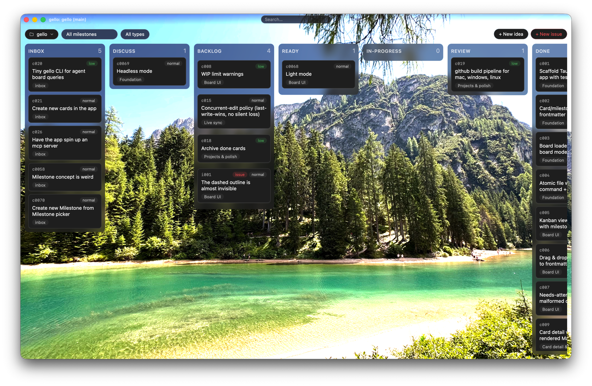

# gello

A local, Markdown-native Kanban board for agentic software development.



gello turns the plan for a software project into a Kanban board — where every
card is a Markdown file. The files in `.gello/` are the **single source of
truth**; the desktop app represents that file tree. Delete the app and you 
still have your board, usable in any editor.

## Why

Agentic development (Claude Code & co.) works best from a written plan broken
into epics and steps. gello keeps everything as Markdown but gives each unit of
work its own file with structured frontmatter, and renders it as a board:

- **Concept → epics → cards**, each its own `.md` file.
- A card's column is its `status` frontmatter field. Moving a card changes the status.
- The board lives in the repo, travels with branches, and shows up in PRs.
- Agents interact with it by reading and editing Markdown, following a documented convention

## How the board works

### Columns

The board's status columns are configured in `.gello/board.yaml`; a fresh board
starts with:

`inbox` → `discuss` → `backlog` → `ready` → `in-progress` → `review` → `done`

**`inbox` is a status, not a folder** — the first column, where freshly captured
cards land until you triage them. **`discuss`** is a triage stage for cards you
want to think through with the agent before committing (the **gello-discuss**
skill drives it). Both ship by default; columns are yours to customize.

### The lifecycle of a card

1. **Capture.** A new idea or bug lands in the inbox column — a title
   and a sentence is enough. No need to pick an epic up front. (`⌘N` for an idea,
   `⌘I` for an issue, `⌘E` for an epic.)
2. **Discuss** *(optional).* Move an ideat to `discuss` when you want to think it
   through with the agent before committing. The agent interviews you — goal,
   scope, edge cases, what "done" looks like — and writes the outcome back into
   the card: a refined **What**, drafted **Acceptance criteria**, and a compact
   **Discussion** section.
3. **Triage.** Drag a card out of the inbox column to give it a status. If it
   has no epic yet, an inline **epic picker** appears (pick an epic, leave it
   standalone with **No epic**, or **+ New epic**); assigning to an epic moves
   the file into that epic's folder. A card can also be assigned from the epic
   selector in the card detail.
4. **Ready.** Move a card to `ready` to tell the agent "pick this up next."
5. **In progress → review.** The agent takes the top `ready` card whose
   dependencies are `done`, sets it `in-progress`, does the work test-first,
   then moves it to `review`. **Only a human moves a card to `done`.**
6. **Issues.** Found a bug in an existing card? Report it from that card's
   detail view — it creates a linked issue (its own `i`-namespace card) that
   references the original.

Cards are ordered within `backlog` / `ready` by a manual rank you set by
dragging; `in-progress` / `review` / `done` order by when the status was last
changed.

### Files, not state

```
<repo>/.gello/
  board.yaml                 # columns, WIP limits, background
  concept.md                 # the long-form product concept
  assets/<card-id>/          # attachments, keyed by card ID
  cards/                     # epic-less cards; a new capture lands here
    c004-typo-in-tooltip.md  #   with status: inbox
  epics/
    e02-board-ui/
      epic.md                # goal, scope, definition of done
      c003-kanban-view.md    # cards, flat within their epic
```

A card's location is its epic assignment: `cards/` (no epic) or
`epics/eNN-name/` (assigned). Every card is one Markdown file with YAML
frontmatter (`id`, `title`, `status`, `epic`, `depends`, `tags`, …) and a body
of `## What`, `## Acceptance criteria` (checkboxes), `## Notes`, and a machine-managed
`## Log`. External edits to any file appear in the app live, without a reload —
and the app's own writes are surgical, so your formatting and comments survive.

See [.gello/concept.md](.gello/concept.md) for the full spec.

## Features

**Board & cards**

- Kanban board grouped by the columns from `board.yaml`, with a per-epic
  and per-type filter.
- Drag & drop to change status (writes the `status` field), or move the focused
  card with the arrow keys.
- Manual drag-to-reorder within `backlog` / `ready`, with precise drop
  positions between cards.
- WIP-limit warnings per column.
- Sticky column headers; columns size to their content; a "needs attention"
  lane surfaces malformed cards instead of hiding them.

**Capture, triage & issues**

- Quick capture (to the inbox column) for ideas, issues, and epics, with
  keyboard-only entry.
- Inline epic picker on drag-triage out of inbox (the drop position is
  preserved), plus an epic selector in the card detail for assigning or
  re-assigning; create a new epic inline from either.
- Report an issue against any card — it's created as a linked `i`-namespace
  card.

**Card detail**

- Rendered Markdown with interactive acceptance-criteria checkboxes.
- Inline editing of title and body; edit tags, status, and epic.
- Paste (`⌘V`) or drag image files into a card — saved under
  `assets/<card-id>/` and linked inline; thumbnails show on the board cards
  (toggle in the right-click **Settings**).
- Concurrent-edit safety: if a file changes on disk while you're editing, you're
  warned rather than silently overwritten.
- Delete a card (removes the file and its asset folder) behind a confirm step.

**Search & appearance**

- Fulltext search in the top bar (matches id, title, tags, and body; all terms
  must match), across every column including `done`.
- Board background via the right-click menu — image, solid color, or gradient —
  with a live preview.
- Right-click context menu (Reload, Background…, Settings) with an app-local
  thumbnails toggle.

**App & sync**

- Live file-watching keeps the board in sync with external edits (yours or an
  agent's).
- Frameless window showing the project folder and current git branch; remembers
  its size across restarts.
- Open any folder as a board, with a recent-projects list; initialize a fresh
  `.gello/` board in an empty repo — the gello convention is written into
  `CLAUDE.md` (created if absent) and appended to `AGENTS.md` when it exists,
  idempotently. Optional prompt to install the agent skills.

## Keyboard shortcuts

| Shortcut | Action |
| --- | --- |
| `⌘N` / `Ctrl+N` | New idea (quick capture) |
| `⌘I` / `Ctrl+I` | New issue (quick capture) |
| `⌘E` / `Ctrl+E` | New epic (quick capture) |
| `⌘Enter` / `Ctrl+Enter` | Submit the quick-entry form |
| `⌘F` / `Ctrl+F` | Focus the search box |
| `⌘S` / `Ctrl+S` | Save while editing a card |
| `←` / `→` | Move the focused card to the previous / next column |
| `Enter` | Open the focused card |
| `Esc` | Cancel / close (form, dialog, picker, menu); clears the search box |

## For agents

The board doubles as the agent's task list. An agent:

- **Queries the board from disk** (a `grep` over frontmatter), never remembered
  state — a human may have moved cards between turns.
- **Picks up work** by taking the top `ready` card (by manual rank) whose
  `depends` are all `done`, and sets it `in-progress`.
- **Works test-first**, appends decisions and blockers to the card's `## Notes`,
  checks off acceptance criteria as tests pass, and adds dated `## Log` lines.
- **Finishes** by setting `status: review` — a human confirms `done`.
- **Captures new ideas** as cards in `cards/` with `status: inbox` rather than
  bloating existing ones.

The convention is written into [CLAUDE.md](CLAUDE.md) (and appended to
`AGENTS.md` when that file exists) at board init. The app can also install
three gello-managed agent skills into a project (under `.claude/skills/`,
`.pi/`, or `.agents/`); it prompts to add or update them when they're missing
or are out-of-date:

- **`gello-discuss`** — interview the human about a card flagged
  `status: discuss` and write the refined outcome (a sharpened **What**,
  drafted **Acceptance criteria**, and a **Discussion** section) back into the
  card. Kicks in when you ask to discuss a card, or when the only `ready`-ish
  work left is discuss-flagged.
- **`gello-onboard`** — migrate an existing project's task organisation
  (`TODO.md`, plan files, docs, issue lists) onto a gello board, preserving
  history. Used to bring a legacy project onto gello.
- **`gello-plan`** — break an epic into dependent child cards: interview the
  human, draft a stepwise plan + dependency graph into `epic.md`, then create
  the wired child cards only after you approve (plan → approve → create).

## Development

```bash
pnpm install
pnpm tauri dev        # run the app
pnpm test             # frontend tests (Vitest)
pnpm typecheck        # tsc --noEmit
pnpm lint             # eslint
cd src-tauri && cargo test   # Rust tests
```

- **Shell:** Tauri 2 (Rust) — kept thin: filesystem read/write/watch, clipboard
  image access.
- **Frontend:** React + TypeScript (strict) + Vite.
- **Tests:** Vitest + React Testing Library; `cargo test` for the Rust layer.

Development is test-driven — see [CLAUDE.md](CLAUDE.md) for the workflow and
conventions.
